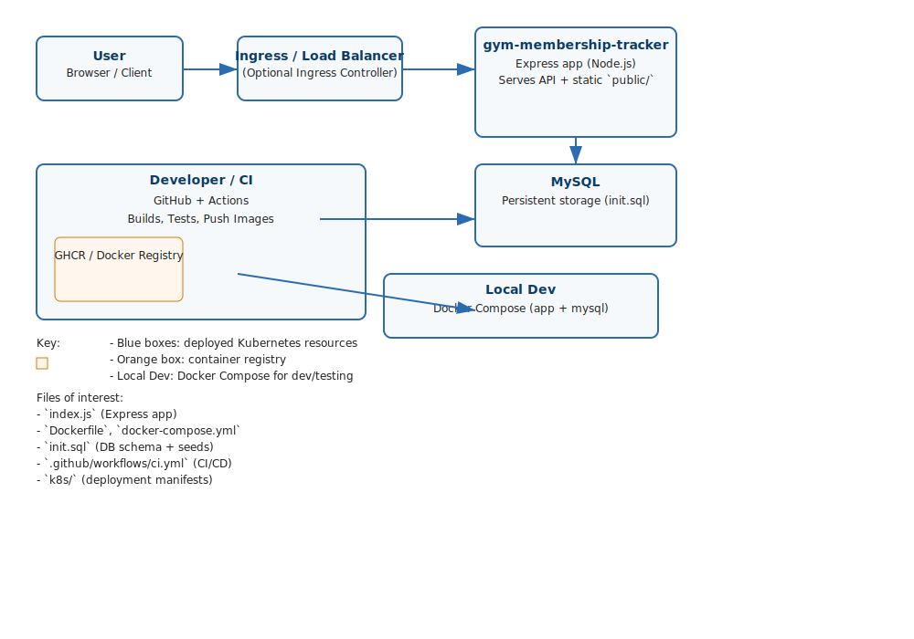

**Architecture Diagram — Gym Memberships Tracker**

Embedded SVG and a compact ASCII view of the architecture.

**ASCII overview**

User (Browser)
  |
  v
Ingress / Load Balancer (optional)
  |
  v
Express App (Node.js) — `index.js`
  - Serves API endpoints and static `public/`
  - Connects to MySQL (env: DB_HOST, DB_USER...)
  |
  v
MySQL (persistent storage, `init.sql` for schema)

Developer / CI
  - GitHub Actions: runs tests, builds image, pushes to GHCR
  - `.github/workflows/ci.yml`

Local Development
  - `docker-compose.yml` runs `app` and `mysql` for fast dev loops
  - `Dockerfile` for image builds

Kubernetes (production)
  - `k8s/deployment.yaml`, `k8s/service.yaml`, HPA
  - Deployment runs `gym-membership-tracker` pods
  - Service exposes pods internal to cluster or via Ingress

**Key files**
- `index.js` — main Express server and DB initialization
- `Dockerfile` / `.dockerignore` — container build
- `docker-compose.yml` — local dev setup
- `init.sql` — DB schema + seeds
- `.github/workflows/ci.yml` — CI/CD pipeline
- `k8s/` — Kubernetes manifests

**Notes / Recommendations**
- CI builds Docker image and pushes to GHCR; use GitHub Actions OIDC or a dedicated deploy user for `kubectl` access.
- Keep secrets in GitHub Actions Secrets: `SLACK_WEBHOOK_URL`, `KUBECONFIG` (or use OIDC), DB credentials for integration tests.
- For production DB, prefer a managed MySQL (RDS / Cloud SQL) or a StatefulSet with PVCs and backups.

---
Files created:
- `docs/architecture.svg`
- `docs/ARCHITECTURE.md`

You can open the SVG in VS Code or any browser to view the diagram. To make this live in the repo, commit and push the new `docs/` files.
